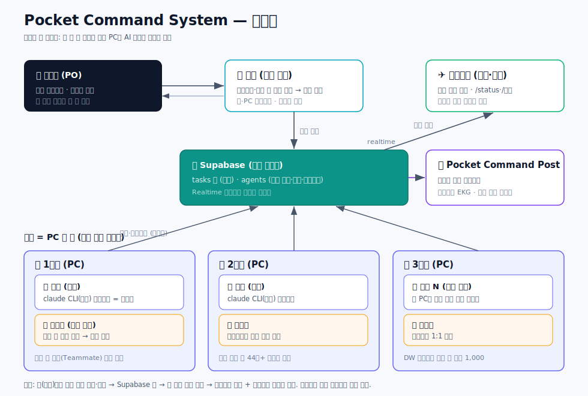
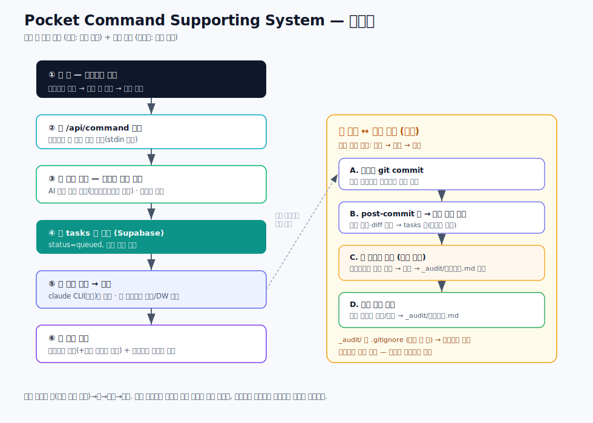
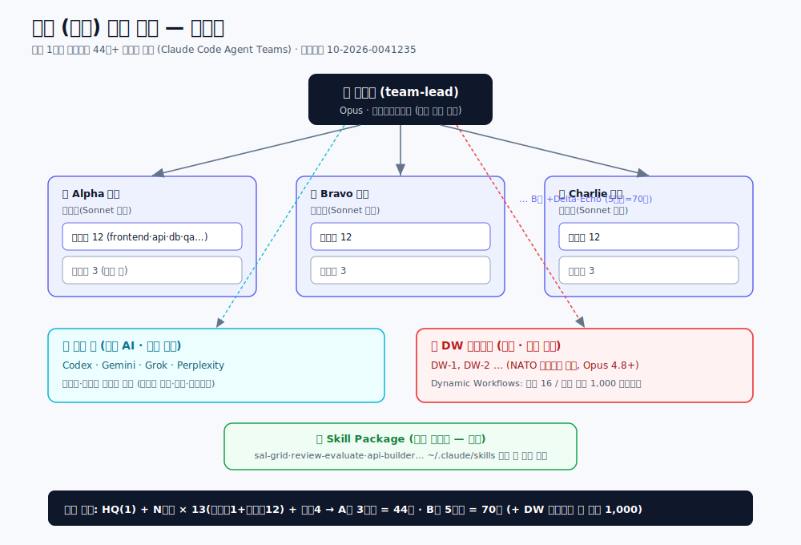
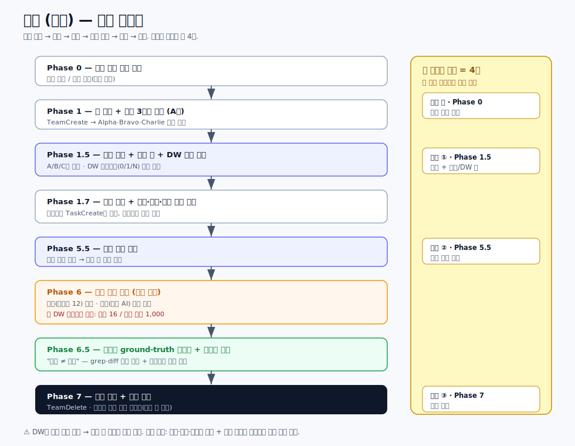

# Pocket Command System — 설명 자료

> **주머니 속 지휘소.** 폰에서 한 줄 명령을 던지면, 여러 대의 PC에 상주한 AI 일꾼들이
> 스스로 일을 나눠 처리하고 결과를 보고하는 시스템.
>
> - **시스템 전체 이름**: Pocket Command System
> - **대시보드 이름**: Pocket Command Post (포켓 커맨드 포스트)
> - 제작: Finder World

---

## 목차
1. [개요 — 한눈에](#1-개요--한눈에)
2. [무엇이 다른가](#2-무엇이-다른가)
3. [핵심 개념 — 군대 편제로 이해하기](#3-핵심-개념--군대-편제로-이해하기)
4. [어떻게 동작하나 — 작업 한 건의 여정](#4-어떻게-동작하나)
5. [주요 기능](#5-주요-기능)
6. [★ 특별 기능 — 백호 소대 편제 (대규모 AI 동시 투입)](#6--특별-기능--백호-소대-편제-대규모-ai-동시-투입)
7. [비교 — Hermes Agent와 Pocket Command System](#7-비교--hermes-agent와-pocket-command-system)
8. [기술 구조](#8-기술-구조)
9. [직접 만들기 — 재현 가이드](#9-직접-만들기--재현-가이드)
10. [한계와 주의점](#10-한계와-주의점)
11. [용어집](#11-용어집)

---

## 1. 개요 — 한눈에

### 한 문장
**"폰으로 명령하면, 내 컴퓨터들이 알아서 일하는 시스템."**

### 어떤 문제를 푸는가
AI(클로드 등)에게 일을 시키려면 보통 **컴퓨터 앞에 앉아 화면을 켜고** 채팅을 해야 합니다.
- 외출 중엔 일을 못 시킨다.
- 한 번에 한 가지 대화만 붙잡고 있어야 한다.
- 컴퓨터를 여러 대 두고 동시에 굴리기 어렵다.

Pocket Command System은 이 셋을 뒤집습니다.
- **폰만 있으면** 됩니다. 텔레그램으로 "○○ 해줘" 한 줄 보내면 끝.
- 일은 **백그라운드에서 알아서** 돌아갑니다. 던져놓고 다른 일 하면 됩니다.
- 일꾼(워커)을 **얼마든지 늘릴 수 있습니다.** 늘릴수록 처리량이 커집니다.

### 비유
회사 대표가 외근 중에 **카톡으로 지시**를 내리면, 사무실의 여러 팀이 각자 일을 받아
처리하고 결과를 다시 카톡으로 보고하는 모습 — 그걸 AI로 구현한 것입니다.

---

## 2. 무엇이 다른가

| 보통의 AI 사용 | Pocket Command System |
|---|---|
| 컴퓨터 앞에 앉아야 함 | **폰에서** 지시 |
| 한 번에 한 대화 | **여러 일꾼 동시** 가동 |
| 사람이 매번 시켜야 함 | **이벤트로 자동** 작동(예: 커밋되면 자동 감사) |
| 결과를 직접 확인 | 텔레그램 보고 + **실시간 대시보드** |
| 일 시키고 검수도 사람이 | **감사관 AI가 자동 검수**하고 일꾼이 답변 |

핵심 가치는 **레버리지**입니다. 사람의 개입 없이도 "일하고 → 검증하고 → 후속 조치"가
스스로 돌아가게 만들 수 있다는 점.

---

## 3. 핵심 개념 — 군대 편제로 이해하기

이 시스템은 **군대 편제 비유**로 구조를 잡았습니다. 역할이 명확해집니다.

| 편제 | 정체 | 설명 |
|---|---|---|
| **지휘관** | **사람(PO)** | 최종 명령권자. 통수권자. |
| **참모장** | **오케스트레이터** (클라우드) | 지휘관을 대신해 *임무를 배정·조율*. 직접 일하지 않고 "누가 할지"만 정함. |
| **중대** | **PC 한 대** | 여러 소대(일꾼)를 호스팅하는 물리 컴퓨터. |
| **소대** | **워커 한 개** | 실제로 일하는 AI 인스턴스(소대장). |
| **분대** | **소환된 팀원** | 소대장이 필요할 때 즉석에서 부르는 임시 조력자. |
| **감사관** | **검수 전용 워커** | 특정 워커의 산출물을 *자동으로* 감사하고 의견을 냄. |

> 핵심 원칙: **분대는 미리 만들지 않는다.** 소대장이 필요할 때만 소환한다.
> 그리고 **감사관은 사람이 부르지 않는다.** 이벤트(커밋 등)로 자동 작동한다.

---

### 📊 시스템 관계도


## 4. 어떻게 동작하나

작업 한 건이 흐르는 과정:

```
[폰: 텔레그램] ──"알파, 리포트 뽑아줘"──▶ 참모장(오케스트레이터)
                                              │  "이건 알파 담당"
                                              ▼
                                       작업 큐 (중앙 DB)
                                              │
                  각 PC의 워커가 큐를 확인 ──▶ 해당 워커가 픽업·실행
                                              │
                          결과 ◀── 텔레그램 보고 + 대시보드 갱신
```

1. 사람이 텔레그램으로 명령을 보낸다.
2. **참모장**이 명령을 읽고 적합한 워커에게 배정한다.
3. 배정된 워커가 자기 PC에서 작업을 실행한다.
4. 결과를 텔레그램으로 보고하고, 대시보드(Pocket Command Post)에 상태가 실시간 반영된다.

**감사 루프(자동)**: 워커가 코드를 커밋하면 → 그 워커의 감사관이 자동으로 깨어나
커밋을 검토 → 감사 의견을 남기고 → 워커가 그 의견에 자동으로 대응(답변)한다.
사람이 끼지 않아도 "작업 → 검증 → 대응"이 돈다.

---

### 📊 작업 흐름도


## 5. 주요 기능

- **폰 우선(Phone-first)**: 텔레그램이 입출력 채널. 긴 글(문단 포함)도 끝까지 전달.
- **수평 확장**: 워커 추가 = 등록 한 줄 + 프로세스 하나. PC를 더 붙이면 또 확장.
- **실시간 관제(대시보드)**: 각 워커의 생존(하트비트)을 심전도(EKG) 그래프로 표시.
  살아있으면 파형, 끊기면 평탄선.
- **자동 기동**: PC를 켜고 로그인하면 그 PC의 워커들이 자동으로 살아난다.
- **감사관(Auditor)**: 워커별 자동 검수. 프로젝트마다 감사 기준이 다르다
  (예: 코드 정확성·보안·범위 일탈 + 프로젝트 특화 기준).
- **감사 ↔ 대응 루프**: 감사 의견에 워커가 자동 답변하고 기록을 남긴다.
- **안전장치**: 감사관은 자동 전용(사람이 못 부름), 감사 기록은 커밋되지 않아 무한루프 방지.

---

## 6. ★ 특별 기능 — 백호 소대 편제 (대규모 AI 동시 투입)

> 이 시스템이 진짜 무서워지는 지점. **워커 하나를 순식간에 수십 명의 AI 부대로 폭발**시킨다.

### 핵심
본 시스템의 **소대(워커)는 Claude Code 인스턴스 = 소대장**입니다. 여기서
**백호(白虎) 소대 편제 스킬**을 발동하면, 그 소대장 하나가 즉시
**44명 이상의 AI 부대**로 확장됩니다 — 소대장 1 + N개 분대 + 용병 + 스킬 패키지.

```
평소:   [소대장(워커) 1명]  ── 순찰(대기)
                │  큰 작업 도착 → 백호 발동
                ▼
완편:   [소대장] + 분대(Alpha·Bravo·Charlie·Delta·Echo …) + 용병4(외부 AI) + Skill Package
        = 44명+ AI가 동시 병렬 작업
```

### 왜 강력한가
- **폰 한 줄이 수십 AI의 동시 작전이 된다.** 텔레그램으로 명령 → 참모장이 한 워커에 배정 →
  그 워커가 백호로 분대를 대량 소환 → **수십 개 AI가 동시에** 작업 → 결과 보고.
- **필요할 때만, 필요한 만큼.** 평소엔 워커 1명, 대형 작업 때만 폭발적으로 증원했다가 거둔다.
  ("분대는 미리 만들지 않는다 — 필요 시 즉석 소환" 원칙과 정확히 맞물린다.)
- **대형 작업을 한 번에**: 코드베이스 전수 점검, 대량 콘텐츠 생성, 멀티 관점 동시 리서치,
  대규모 마이그레이션 등 — 한 명령으로 동시 투입.

### 구성 (요지)
- **편제 공식**: HQ(소대장 1) + N개 분대 × 13(분대장 1 + 정규병 12) + 용병 4(외부 AI) + Skill Package(지속 확장).
  - **A형(기본, 3분대) = 44명** · B형(5분대) = 70명 · C형(6분대~) = 그 이상 (예비병은 분대당 3명 별도).
- 용병 4 = Codex·Gemini·Grok·Perplexity (외부 AI 공유 풀).
- 비유: 평소 혼자 순찰하던 소대장이, 작전 명령이 떨어지면 즉석에서 1개 완편 소대를 꾸려 투입.

### ★★ 특수부대 투입 — DW(Dynamic Workflows): 숫자가 또 폭발한다
기본 분대(A형 44명)는 **그대로 두고**, 그 위에 **특수부대 DW(Dynamic Workflows)를 추가 편성**하면
동원 규모가 다시 폭발합니다. (DW는 일반 분대를 대체하는 게 아니라 **추가**되는 부대 — 보병 옆의 포병.)

- **DW = 다중 에이전트 워크플로우(대량 화력).** 하나의 작업을 서브에이전트로 fan-out해 동시 처리·종합.
  - **DW 엔진 1기 = 동시 16 에이전트 / 누적 최대 1,000 에이전트.** DW 부대는 N개까지 편성 가능.
- 전개 단계:
  ```
  소대장(워커 1)
     └─ 백호 → 일반 분대 완편 (A형 44명)
            └─ + DW 특수부대 추가 → 각 DW가 동시 16 병렬 / 누적 최대 1,000 에이전트로 포격
                   = 누적 동원 규모 수백~천 단위 (동시 투입은 DW 1기당 16씩 병렬)
  ```
- 즉 **PC 여러 대(중대) + 워커별 백호 완편(44명) + DW 특수부대**가 더해지면, 폰 한 줄 명령이
  **동시 수십~수백 병렬 + 누적 최대 천 단위**의 AI 작전이 됩니다.
  > ⚠️ 단위 주의: **1,000은 *동시*가 아니라 DW 1기의 *누적 처리* 상한**이다. 동시 투입은 DW당 16씩(+백호 분대 수십). "천 명이 한꺼번에"가 아니라 "누적 천 단위를 처리"로 읽는 게 정확하다.
- 조건: DW는 **Opus 4.8 이상 + Claude Max·Team·Enterprise 플랜**에서만 가동(Pro 미지원).
- ⚠️ **안전장치**: DW는 토큰을 대량 소모하므로 **발동 전 지휘관(PO) 승인 필수**(규모·목적·예상 비용 보고 후).

### 특허
백호 소대 편제 방식은 **특허출원** 되어 있습니다 — 출원번호 **10-2026-0041235**(출원일 2026.03.07).

> 요약: Pocket Command System이 "여러 워커의 수평 확장"이라면, 백호는 "워커 한 명의 수직 폭발".
> 둘을 합치면 **N대의 PC × 각 워커의 분대 폭발** = 폰 한 줄로 지휘하는 대규모 AI 군단.

### 📊 백호 편제 관계도


### 📊 백호 작전 흐름도


---

## 7. 비교 — Hermes Agent와 Pocket Command System

Pocket Command System은 잘 알려진 에이전트 하네스 **Hermes Agent**(NousResearch)의 설계를 **출발점 삼아 만든
Claude Code 네이티브 재구현**입니다. 아래는 성능 벤치마크가 아니라 공개 자료 기반 설계 비교입니다.

> "멀티 워커·오케스트레이션·공유 작업보드·멀티호스트·텔레그램"은 **Hermes Agent에 이미 있는 공통 토대**입니다 — 우리만의 차별점이 아닙니다.

### 공통 토대 (Hermes Agent가 원조, 우리도 채택)
- **멀티 워커 + 오케스트레이션** — Hermes Agent는 `role="orchestrator"` 자식이 워커를 스폰(트리 깊이 `max_spawn_depth`).
- **공유 작업보드** — Hermes Agent **Kanban**: 작업=DB 행, 워커=독립 OS 프로세스, 프로필 간 공유 (우리 Supabase `tasks` 큐와 동형).
- **멀티호스트** — Hermes Agent 6개 백엔드(local·Docker·SSH·Daytona·Singularity·Modal).
- **다채널 메신저**(텔레그램 등), 상시 가동, 스킬, 스케줄(cron), **DAG 작업 분해**, 전문 역할.

### Hermes Agent가 더 성숙/우위인 축
- **영속 기억 + 자기 학습 루프**(execute→evaluate→refine + 크로스세션 회상)로 *스스로 축적·개선*. 우리 워커는 기본 세션 기억 의존.
- **다채널 20+**(Discord·Slack·WhatsApp·Signal·Email) + **음성 메모 자동 전사**.
- **경량·이식성**($5 VPS 구동) + **보안**(self-generated skills로 공급망 공격면 차단, CVE 0 보고) + **오픈소스(MIT)**.
- 멀티호스트 백엔드 다양성(Docker·SSH·서버리스 등).

### Pocket Command System의 실제 차별점
1. **Claude Code 네이티브 대량 폭발** — 워커가 claude CLI(구독) 위에서 돌고, **백호(Agent Teams) 완편 44명 + DW(Dynamic Workflows) 최대 1,000**으로 단일 명령을 군단급으로 전개. Hermes Agent 일반 서브에이전트와 다른 *Claude 전용* 메커니즘.
2. **감사관 견제 거버넌스** — 자기 학습이 아니라 **독립된 감사관**이 워커 커밋을 자동 감사 → 워커가 자동 대응(감사↔대응 루프). 산출물 품질을 *별도 주체*가 견제.
3. **군대 편제 UX + 부대 관제 대시보드** — 지휘관·참모장·중대·소대·분대·감사관의 일관된 지휘 메타포 + 하트비트 EKG 대시보드(Pocket Command Post). (Hermes Agent Kanban이 *작업* 중심 보드라면, 이쪽은 *부대 생존·상태* 중심 관제.)

### 한 줄 정리
> Hermes Agent는 **"스스로 자라는 범용 에이전트 런타임"**(원조·성숙·다채널·학습·이식성).
> Pocket Command System은 그걸 벤치마킹한 **"Claude Code 네이티브 + 군대식 거버넌스"** 버전 —
> *개인이 폰으로 다수 PC의 Claude 부대를 지휘하고, 백호/DW로 폭발시키며, 감사관으로 견제*하는 데 특화했다.
> **닮은 토대 위에, Claude 전용 대량전개·감사 거버넌스·편제 UX를 얹은 것**이 본질이다.

<sub>참고(공개 자료): NousResearch/hermes-agent — 공식 docs(Subagent Delegation, Kanban Multi-Agent Board, Profiles, Terminal backends) 및 Multi-Agent Architecture(issue #344). 위 표는 벤치마크 수치가 아니라 공개 문서 기반 설계 비교다.</sub>

---

## 8. 기술 구조

### 8.1 스택
- **대시보드**: Next.js (App Router) + TypeScript, Vercel 배포.
- **데이터/실시간**: Supabase(PostgreSQL) — `agents`·`tasks` 테이블 + Realtime 구독.
- **워커 두뇌**: claude CLI(**구독 인증**, API 키 아님) — 로컬 PC의 Claude Code를 실행 엔진으로.
- **입출력 채널**: Telegram Bot (Webhook 수신 + sendMessage 회신).
- **호스트**: 각 사용자 PC(Windows) — 워커는 Node(tsx) 데몬 프로세스.

### 8.2 데이터 모델 (핵심 2테이블)
- `agents`: 워커 명단. `name`·`role`·`squad`(중대)·`kind`(python/claude_code/orchestrator)·
  `host`(PC)·`workdir`·`status`·`last_heartbeat_at`·`beats` 등.
- `tasks`: 작업 큐. `command_text`·`assigned_agent`·`status`(queued/in_progress/done/failed)·
  `source_chat_id`(회신 대상)·`result`.

### 8.3 컴포넌트
```
[Telegram] ─webhook─▶ /api/telegram ─▶ routeCommand(오케스트레이터)
                                          │ 담당 결정(이름>LLM>키워드>sticky)
                                          ▼
                                    tasks 큐(Supabase)
                                          ▲ 폴링/픽업
        각 PC: agent-runner.ts 데몬 ──────┘
          - 하트비트(5초): 살아있음 신호
          - 큐 픽업: 자기 앞 작업 실행(claude CLI)
          - 중단 감지: control='stop' 시 즉시 kill
          - 결과 → tasks.result + Telegram + 대시보드
```

### 8.4 핵심 메커니즘
- **하트비트/생존감지**: 워커가 5초마다 `last_heartbeat_at` 갱신. 대시보드는 이 시각으로
  offline 판정. (Supabase 호출에 타임아웃을 둬 stale 소켓에 의한 정지 방지.)
- **명령 전달**: 프롬프트는 셸 명령줄이 아니라 **stdin**으로 claude에 전달
  (Windows cmd.exe가 멀티라인 인자를 첫 줄에서 잘라먹는 문제 회피).
- **감사 파이프라인**: 프로젝트 repo의 `post-commit` 훅 → 커밋 정보(해시·diff)를 캡처해
  감사 작업을 큐에 적재 → 감사관(claude_code 워커)이 검토 → 의견을 repo 안
  `_audit/`(gitignore) 폴더에 기록. 감사관이 끝나면 워커에게 "대응" 작업을 자동 적재.
- **감사관 격리**: 감사관은 소스 **읽기 전용**, 오케스트레이터 배정 후보에서 제외(자동 전용).

### 8.5 운영 스크립트
- `start-workers.ps1` / `install-autostart.ps1`: 로그온 시 워커 자동 기동(작업 스케줄러).
- `update.bat`: git pull + 의존성 + 이 PC 워커 재기동(원클릭 업데이트).
- `install-auditor.ps1`: repo에 `_audit/` + `.gitignore` + post-commit 훅 설치.

---

## 9. 직접 만들기 — 재현 가이드

대략의 단계(상세는 실습 강의에서):
1. **Supabase 프로젝트** 생성 → `agents`·`tasks` 스키마 적용(SQL).
2. **Telegram 봇** 생성(BotFather) → 토큰 발급 → Webhook 등록.
3. **대시보드** 배포(Next.js → Vercel) + 환경변수(Supabase·텔레그램) 설정.
4. **워커 데몬** 설치: 각 PC에 claude CLI(구독 로그인) + Node + repo 클론 → 워커 기동.
5. **에이전트 등록**: `agents` 테이블에 워커 한 줄 추가(host=그 PC) → 자동 기동에 포함.
6. (선택) **감사관**: `install-auditor.ps1`로 프로젝트에 감사 파이프라인 장착.

> ⚠️ claude는 **구독(OAuth) 인증**으로 호출합니다. API 키를 끼우지 않도록 환경변수를 정리합니다.

소스: [github.com/SUNWOONGKYU/pocket-command-system](https://github.com/SUNWOONGKYU/pocket-command-system) (Apache-2.0)

---

## 10. 한계와 주의점

규모가 커질수록 유의해야 할 지점들입니다.
- **보안**: 워커가 강한 권한으로 코드를 실행하고 명령 채널이 텔레그램이다.
  봇/챗 접근이 곧 PC 제어가 될 수 있어, 규모가 커지면 **발신자 인증**이 필요해진다.
- **오류 전파**: 무인 트리거가 엮이면 한 워커의 잘못된 출력이 다음 입력이 되어 누적될 수 있다.
  → 그래서 **감사관(검증 워커)**을 먼저 둔다.
- **관제 부하**: 워커가 많아지면 텔레그램 보고가 홍수가 된다 → 중요도 필터가 필요.
- **비용**: 워커 수보다 **트리거 빈도**에 비례. 커밋 폭주 시 감사 큐가 쌓일 수 있다.

---

## 11. 용어집

- **지휘관(PO)**: 사람. 최종 명령권자.
- **참모장 / 오케스트레이터**: 명령을 받아 담당 워커에게 배정·조율하는 클라우드 함수.
- **중대 / 소대 / 분대**: PC / 워커 / 즉석 소환 팀원.
- **감사관(Auditor)**: 특정 워커의 산출물을 자동 검수하는 전용 워커.
- **하트비트**: 워커가 살아있음을 주기적으로 알리는 신호(대시보드 EKG).
- **워커(Worker)**: 실제 작업을 실행하는 AI 데몬 프로세스.
- **Pocket Command Post**: 이 시스템의 대시보드(관제 화면) 이름.

---

*이 문서는 Pocket Command System의 공식 설명 자료입니다. HTML·PPT·영상 버전의 원천 자료로 사용됩니다.*
